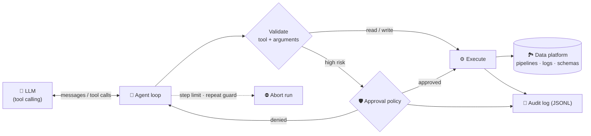

<h1 align="center">🤖 Autonomous DataOps Agent</h1>

<p align="center">
  <b>An AI agent that detects broken data pipelines, diagnoses the root cause, fixes what is safe to fix, and escalates what is not, with human approval gates and a full audit trail.</b>
</p>

<p align="center">
  
  
  
  
  
</p>

---

## 🎯 The problem

Data engineers lose hours to the same on-call loop: a pipeline fails at 3 a.m., someone reads logs, guesses a cause, applies a fix, restarts, and checks. Most of that loop is repeatable, but *some* fixes (rotating credentials, rolling back a deploy, spending money on bigger machines) should never happen without a human.

This project automates the repeatable part **and enforces the boundary** around the risky part.

## 🎬 Demo

Four incidents are injected into a simulated data platform. The agent investigates and acts under an approval policy:

```text
🚨 4 unhealthy pipeline(s): orders_ingest, clickstream_agg, inventory_sync, users_dim

🔍 [ 1] list_pipelines()
🔍 [ 2] get_logs(pipeline=orders_ingest)
🔍 [ 3] get_schema_diff(pipeline=orders_ingest)
🛡️  [ 4] apply_schema_mapping(column=amount, target_type=DOUBLE)  →  APPROVED: type cast to a standard type
🔧 [ 5] restart_job(pipeline=orders_ingest)
🔍 [ 6] get_status(pipeline=orders_ingest)                        ✅ verified healthy
🔍 [ 8] get_status(pipeline=clickstream_agg)
🛡️  [ 9] scale_job_memory(memory_mb=4096)  →  APPROVED: memory within the 8192 MB policy cap
🔧 [10] restart_job(pipeline=clickstream_agg)                     ✅ verified healthy
🔧 [13] escalate_to_human(inventory_sync)  "Upstream credentials expired. Outside the agent's authority."
🛡️  [16] rollback_deployment(pipeline=users_dim)  →  DENIED: always requires human approval
🔧 [17] escalate_to_human(users_dim)       "Proposed fix was not approved and needs a human decision."
🔧 [18] send_notification(...)

Final pipeline state:
  ✅ orders_ingest    healthy        ← fixed autonomously
  ✅ clickstream_agg  healthy        ← fixed autonomously
  ❌ inventory_sync   failed         ← escalated (INC-1001)
  ❌ users_dim        degraded       ← escalated (INC-1002)
  ✅ billing_export   healthy
```

| Incident | Root cause | What the agent does |
|---|---|---|
| 💥 **Schema drift** | Source started sending `amount` as `STRING` | Diffs schemas → casts to `DOUBLE` (approved) → restarts → verifies |
| 🧠 **Out of memory** | Executor heap too small | Reads current limit → doubles it within the cap (approved) → restarts → verifies |
| 🔑 **Expired credentials** | Upstream API token expired | Recognises it cannot fix this → **escalates** with a ticket |
| 📉 **Null-rate spike** | Latest deploy broke a column | Runs quality check → proposes rollback → **denied by policy** → escalates |

## 🏗️ Architecture



## 🛡️ Safety design (the interesting part)

Autonomous agents that can change production are only useful if they are *bounded*. This one has:

| Guardrail | How it works |
|---|---|
| **Risk-tiered tools** | Every tool is tagged `read`, `write` (reversible) or `high` (costly / hard to undo) |
| **Approval gates** | `high` tools go through a pluggable policy: `policy` (rule-based), `ask` (interactive prompt), `auto`, `deny` |
| **Denied means denied** | A refused action is returned to the model as `denied`; the agent must escalate rather than retry |
| **Bounded fixes** | The default policy caps memory at 8 GB and only allows casts to standard types; rollbacks always need a human |
| **Argument validation** | Unknown tools, missing / extra / wrongly-typed arguments are blocked before anything runs |
| **Loop protection** | The same state-changing call is blocked after 2 repeats; a hard step limit aborts runaway runs |
| **Audit trail** | Every observation, approval decision, action and block is timestamped and written as JSONL |
| **Verify, don't assume** | Fixes are followed by a status check; if the pipeline is still unhealthy the agent escalates |

## 🚀 Quick start

```bash
git clone https://github.com/shanmukhasaiteja/autonomous-dataops-agent.git
cd autonomous-dataops-agent
pip install -e ".[dev]"

python -m dataops_agent                              # all four incidents, policy approvals
python -m dataops_agent --scenario oom               # a single incident
python -m dataops_agent --approval auto              # approve everything (null spike now gets rolled back)
python -m dataops_agent --approval deny              # deny everything risky (agent escalates all of it)
python -m dataops_agent --approval ask               # you decide, interactively
python -m dataops_agent --audit-log runs/audit.jsonl # keep the audit trail
pytest -q                                            # 23 tests
```

### Use a real LLM

```bash
cp .env.example .env        # add LLM_API_KEY (OpenRouter by default; any OpenAI-compatible endpoint works)
export $(grep -v '^#' .env | xargs)
python -m dataops_agent --llm openai
```

> **Note on the offline mode:** `--llm heuristic` (the default) is a deterministic, rule-based planner, **not an LLM**. It exists so the loop, guardrails and approval flow can be demoed and tested with no API key and in CI. `--llm openai` swaps in real model tool-calling through the same interface, so the safety layer is identical for both.

## 📂 Project structure

```
src/dataops_agent/
├── agent.py         # agent loop, guardrails, audit log
├── tools.py         # tool registry: JSON-schema specs, validation, risk tiers
├── approvals.py     # approval policies (policy / ask / auto / deny)
├── llm.py           # OpenAI-compatible client + offline heuristic planner
├── environment.py   # simulated data platform with 4 injectable incidents
└── cli.py
tests/               # 23 tests: environment, tools, agent guardrails, CLI
```

## 🧠 Design decisions

- **Provider-agnostic LLM interface:** a 1-method protocol (`chat(messages, tools)`) keeps the agent independent of any SDK, so models can be swapped without touching the safety layer.
- **No agent framework on purpose:** the loop is about 60 lines, so every guardrail is visible and testable. Frameworks like LangGraph are a natural next step for multi-agent or long-running workflows.
- **A simulator that punishes wrong fixes:** restarting an out-of-memory job fails again, so "just restart it" does not look like success. Tests assert on actual state, not on what the agent said.
- **Denied is a first-class outcome:** the interesting behaviour is not fixing things; it is correctly *not* fixing things and handing off with context.

## 🗺️ Roadmap

- [ ] Connect to a real orchestrator (Airflow REST API) and warehouse instead of the simulator
- [ ] Wire into [secure-log-streaming-pipeline](https://github.com/shanmukhasaiteja/secure-log-streaming-pipeline) to operate its Spark / dbt jobs
- [ ] Slack approval flow (approve / deny from a message)
- [ ] Evaluation harness: score the agent on a suite of seeded incidents across different models

## 📄 License

MIT © Shanmukh
